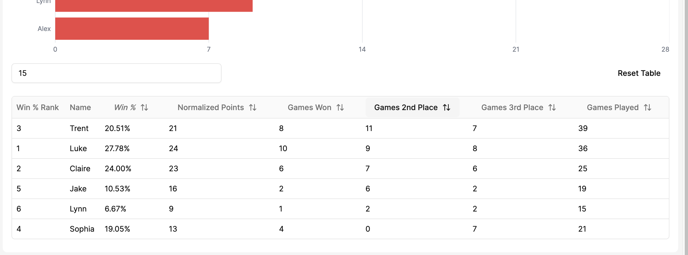
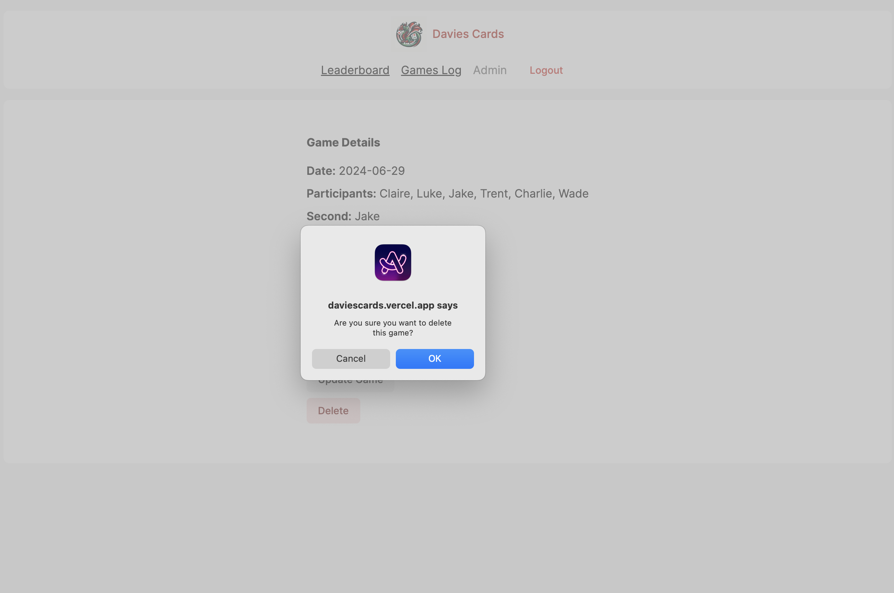
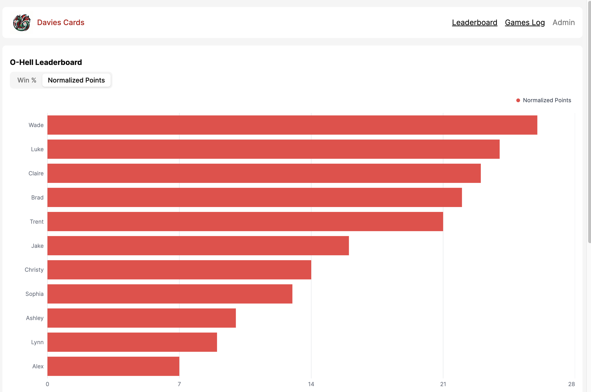
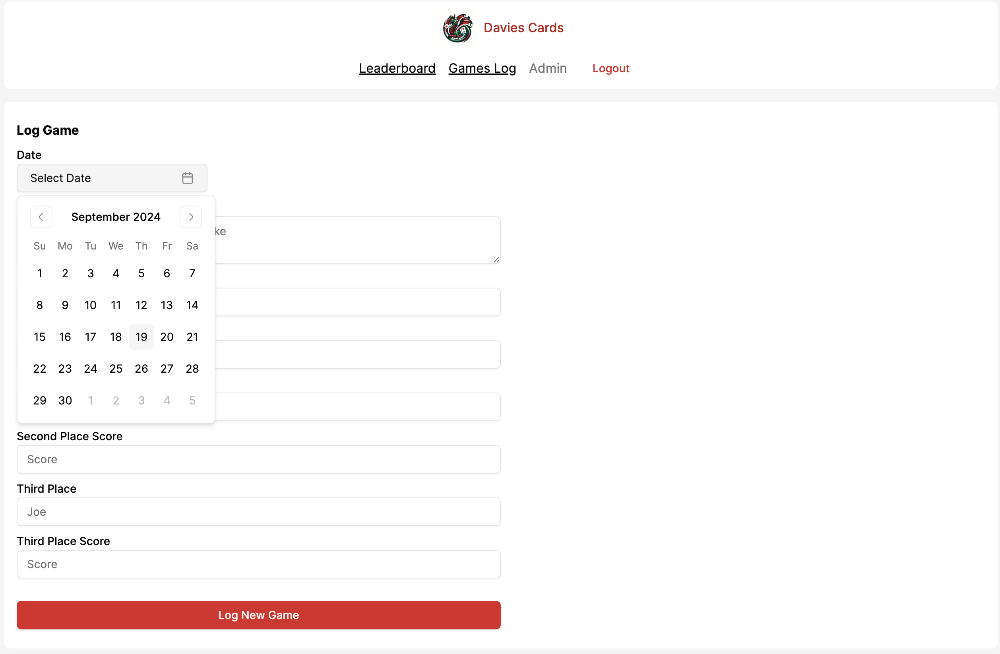
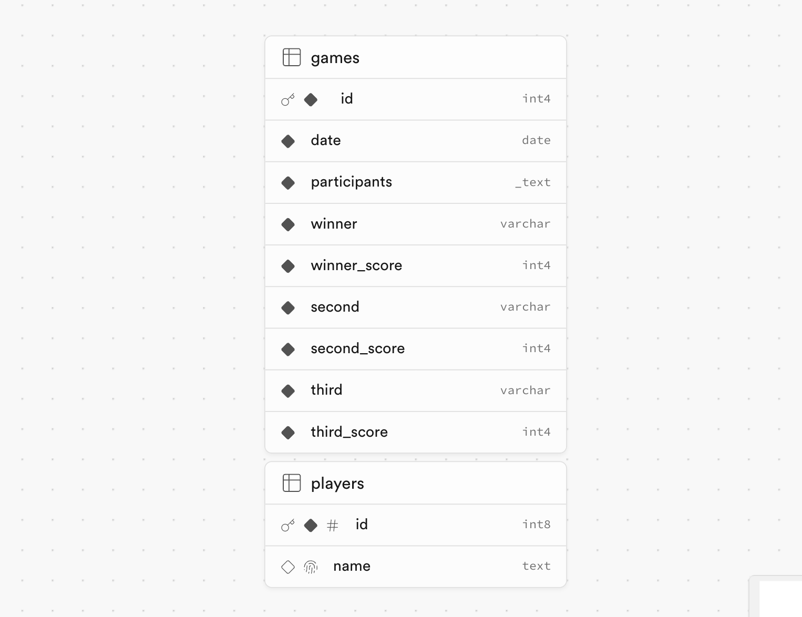

# Davies Cards
A fullstack Next.js/Supabse app to log family card games. Link: https://daviescards.vercel.app

## Features
- Full CRUD on games and players from an Admin account
- Interactive charts and tables

### Images

### Data Model

